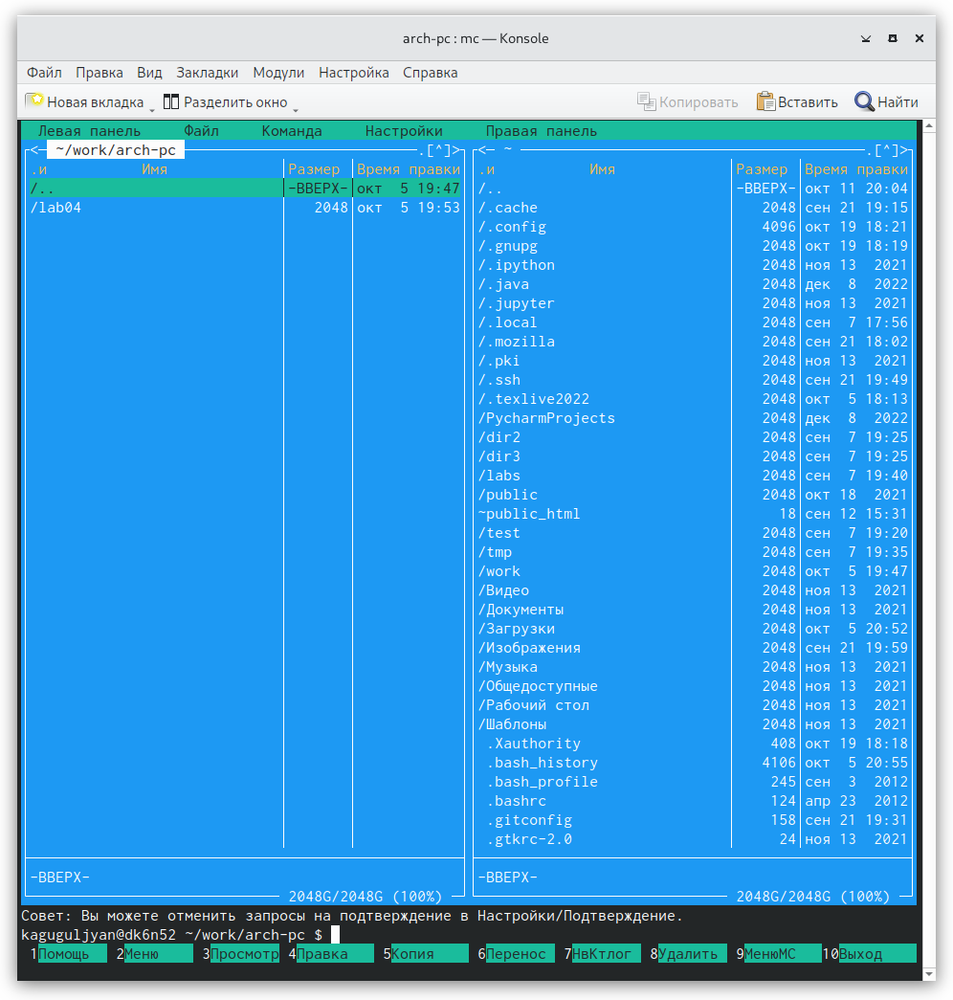
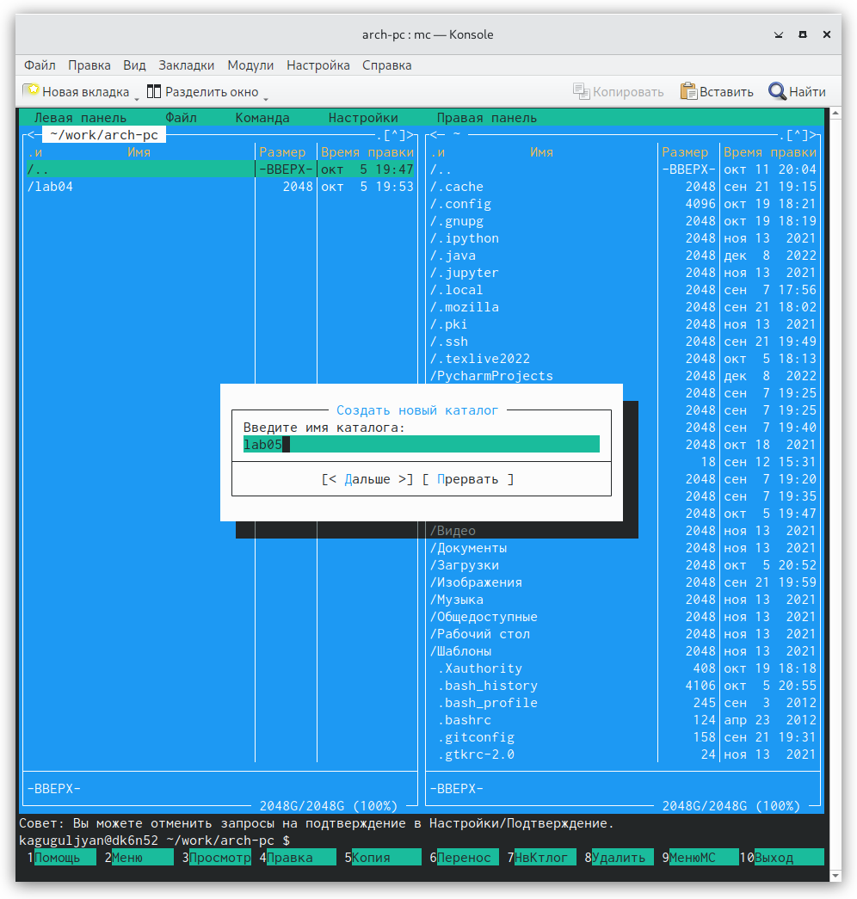
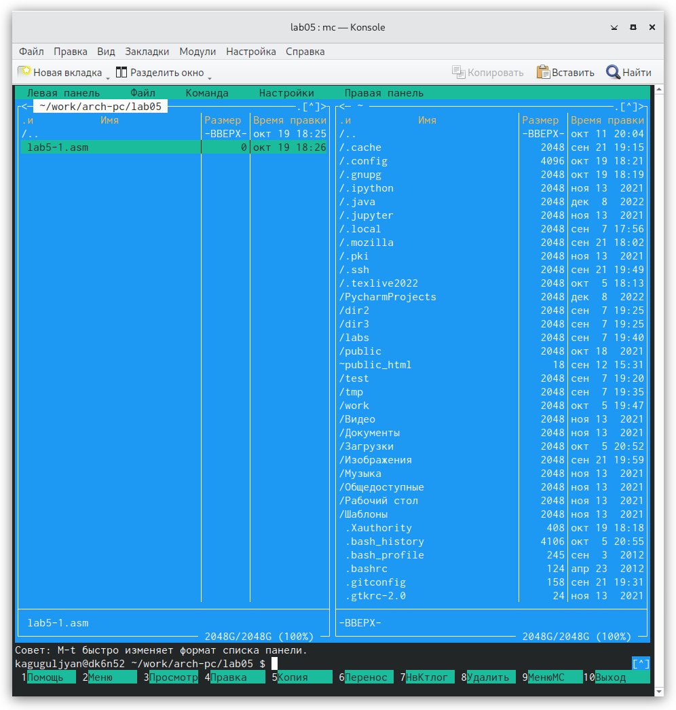
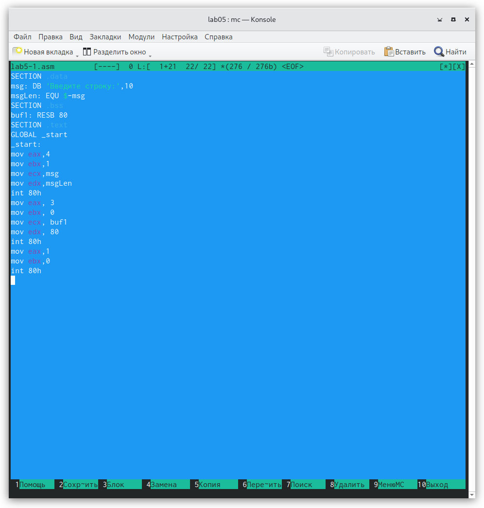
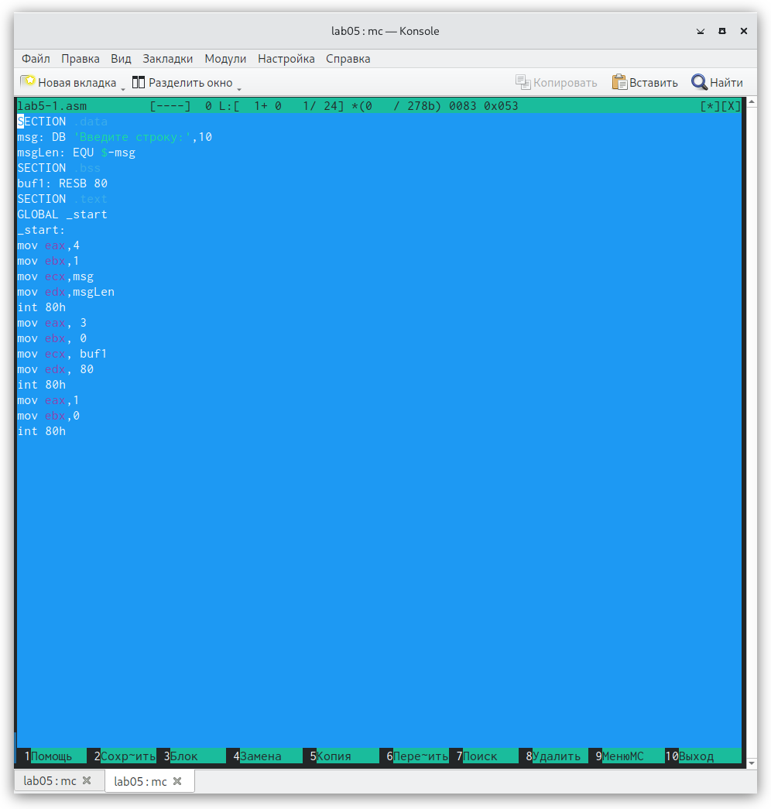
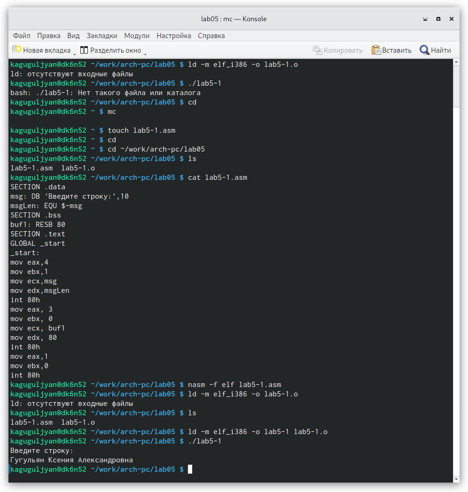
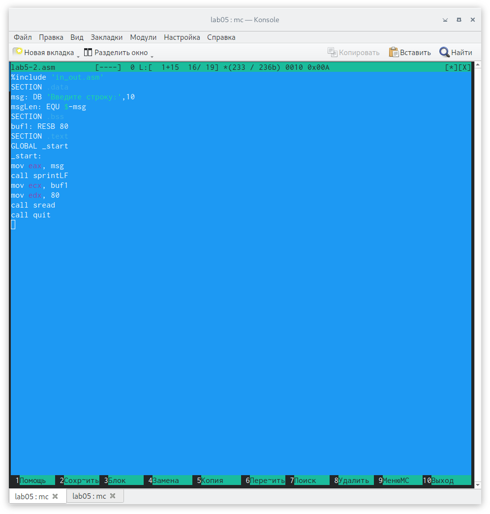
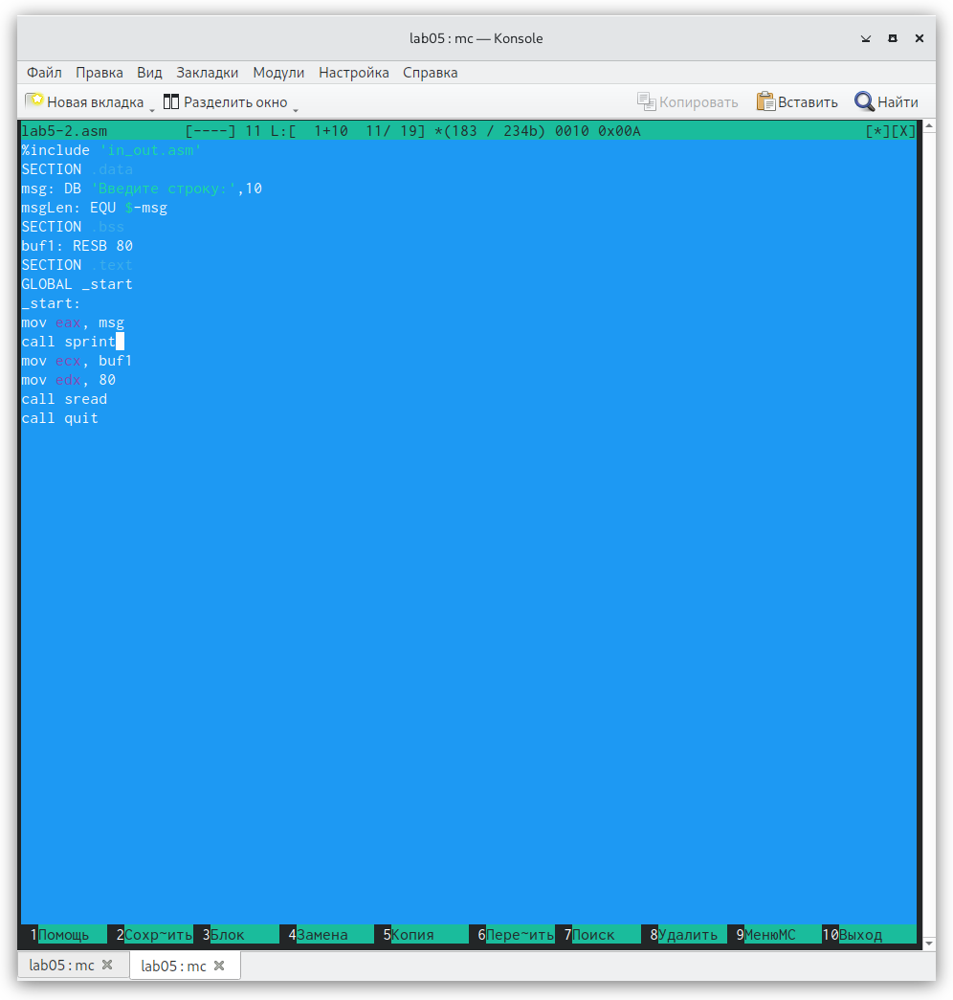
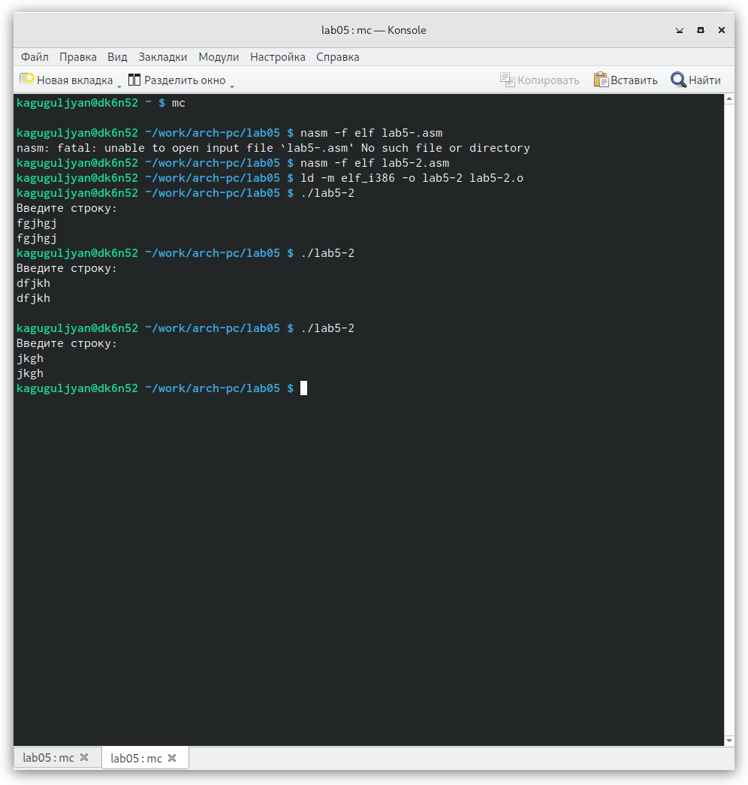

---
## Front matter
title: "Лабораторная работа №5"
subtitle: "НПМбв-02-21"
author: "Гугульян Ксения Александровна"

## Generic otions
lang: ru-RU
toc-title: "Содержание"

## Bibliography
bibliography: bib/cite.bib
csl: pandoc/csl/gost-r-7-0-5-2008-numeric.csl

## Pdf output format
toc: true # Table of contents
toc-depth: 2
lof: true # List of figures
lot: true # List of tables
fontsize: 12pt
linestretch: 1.5
papersize: a4
documentclass: scrreprt
## I18n polyglossia
polyglossia-lang:
  name: russian
  options:
	- spelling=modern
	- babelshorthands=true
polyglossia-otherlangs:
  name: english
## I18n babel
babel-lang: russian
babel-otherlangs: english
## Fonts
mainfont: PT Serif
romanfont: PT Serif
sansfont: PT Sans
monofont: PT Mono
mainfontoptions: Ligatures=TeX
romanfontoptions: Ligatures=TeX
sansfontoptions: Ligatures=TeX,Scale=MatchLowercase
monofontoptions: Scale=MatchLowercase,Scale=0.9
## Biblatex
biblatex: true
biblio-style: "gost-numeric"
biblatexoptions:
  - parentracker=true
  - backend=biber
  - hyperref=auto
  - language=auto
  - autolang=other*
  - citestyle=gost-numeric
## Pandoc-crossref LaTeX customization
figureTitle: "Рис."
tableTitle: "Таблица"
listingTitle: "Листинг"
lofTitle: "Список иллюстраций"
lotTitle: "Список таблиц"
lolTitle: "Листинги"
## Misc options
indent: true
header-includes:
  - \usepackage{indentfirst}
  - \usepackage{float} # keep figures where there are in the text
  - \floatplacement{figure}{H} # keep figures where there are in the text
---

# Цель работы

Приобретение практических навыков работы в Midnight Commander. Освоение инструкций
языка ассемблера mov и int.

# Задание

1. Откройте Midnight Commander
2. Пользуясь клавишами ↑ , ↓ и Enter перейдите в каталог ~/work/arch-pc созданный
при выполнении лабораторной работы №4
3. С помощью функциональной клавиши F7 создайте папку lab05 (рис. 5.3) и перейдите
в созданный каталог.
4. Пользуясь строкой ввода и командой touch создайте файл lab5-1.asm 
5. С помощью функциональной клавиши F4 откройте файл lab5-1.asm для редактирования во встроенном редакторе. Как правило в качестве встроенного редактора Midnight
Commander используется редакторы nano или mcedit
6. Введите текст программы из листинга 5.1 (можно без комментариев), сохраните изменения и закройте файл.
7. С помощью функциональной клавиши F3 откройте файл lab5-1.asm для просмотра.
Убедитесь, что файл содержит текст программы.
8. Оттранслируйте текст программы lab5-1.asm в объектный файл. Выполните компоновку объектного файла и запустите получившийся исполняемый файл. Программа выводит строку 'Введите строку:' и ожидает ввода с клавиатуры. На запрос введите
Ваши ФИО.
9. Скачайте файл in_out.asm со страницы курса в ТУИС.
10. Подключаемый файл in_out.asm должен лежать в том же каталоге, что и файл с программой, в которой он используется.
11. С помощью функциональной клавиши F6 создайте копию файла lab5-1.asm с именем
lab5-2.asm. Выделите файл lab5-1.asm, нажмите клавишу F6 , введите имя файла
lab5-2.asm и нажмите клавишу Enter
12. Исправьте текст программы в файле lab5-2.asm с использование подпрограмм из
внешнего файла in_out.asm (используйте подпрограммы sprintLF, sread и quit) в
соответствии с листингом 5.2. Создайте исполняемый файл и проверьте его работу.
13. В файле lab5-2.asm замените подпрограмму sprintLF на sprint. Создайте исполняемый файл и проверьте его работу. В чем разница?

# Выполнение лабораторной работы

1. Откроем Midnight Commander и пользуясь клавишами ↑ , ↓ и Enter перейдём в каталог ~/work/arch-pc созданный
при выполнении лабораторной работы №4(рис. @fig:001).

{#fig:001 width=70%}

2. С помощью функциональной клавиши F7 создаём папку lab05 (рис. 5.3) и переходим
в созданный каталог(рис. @fig:002).

{#fig:002 width=70%}

3. Пользуясь строкой ввода и командой touch создайте файл lab5-1.asm(рис. @fig:003).

{#fig:003 width=70%}

4. С помощью функциональной клавиши F4 откроем файл lab5-1.asm для редактирования во встроенном редакторе. Введём текст программы из листинга 5.1, сохраним изменения и закроем файл(рис. @fig:004).

{#fig:004 width=70%}

5. С помощью функциональной клавиши F3 откроем файл lab5-1.asm для просмотра(рис. @fig:005).

{#fig:005 width=70%}

6. Оттранслируем текст программы lab5-1.asm в объектный файл. Выполним компоновку объектного файла и запустим получившийся исполняемый файл. На запрос введём ФИО(рис. @fig:006).

{#fig:006 width=70%}

7. С помощью функциональной клавиши F6 создаём копию файла lab5-1.asm с именем
lab5-2.asm. Выделим файл lab5-1.asm, нажмём клавишу F6 , введём имя файла
lab5-2.asm и нажмём клавишу Enter. Исправим текст программы в файле lab5-2.asm с использование подпрограмм из внешнего файла in_out.asm в соответствии с листингом 5.2. Создаём исполняемый файл и проверяем его работу(рис. @fig:007).

{#fig:007 width=70%}

8. В файле lab5-2.asm заменим подпрограмму sprintLF на sprint. Создаём исполняемый файл и проверяем его работу(рис. @fig:008).

{#fig:008 width=70%}

9. В чем разница(рис. @fig:009)?
Когда пишется sprintLF при выводе на экран добавляет к сообщению символ перевода строки. sprint- вывод сообщения на экран.

{#fig:009 width=70%}

# Выводы

Здесь кратко описываются итоги проделанной работы.

# Список литературы{.unnumbered}

::: {#refs}
:::
