---
## Front matter
title: "Отчёт по лабораторной работе №6"
subtitle: "НПМбв-02-21"
author: "Гугульян Ксения Александровна"

## Generic otions
lang: ru-RU
toc-title: "Содержание"

## Bibliography
bibliography: bib/cite.bib
csl: pandoc/csl/gost-r-7-0-5-2008-numeric.csl

## Pdf output format
toc: true # Table of contents
toc-depth: 2
lof: true # List of figures
lot: true # List of tables
fontsize: 12pt
linestretch: 1.5
papersize: a4
documentclass: scrreprt
## I18n polyglossia
polyglossia-lang:
  name: russian
  options:
	- spelling=modern
	- babelshorthands=true
polyglossia-otherlangs:
  name: english
## I18n babel
babel-lang: russian
babel-otherlangs: english
## Fonts
mainfont: PT Serif
romanfont: PT Serif
sansfont: PT Sans
monofont: PT Mono
mainfontoptions: Ligatures=TeX
romanfontoptions: Ligatures=TeX
sansfontoptions: Ligatures=TeX,Scale=MatchLowercase
monofontoptions: Scale=MatchLowercase,Scale=0.9
## Biblatex
biblatex: true
biblio-style: "gost-numeric"
biblatexoptions:
  - parentracker=true
  - backend=biber
  - hyperref=auto
  - language=auto
  - autolang=other*
  - citestyle=gost-numeric
## Pandoc-crossref LaTeX customization
figureTitle: "Рис."
tableTitle: "Таблица"
listingTitle: "Листинг"
lofTitle: "Список иллюстраций"
lotTitle: "Список таблиц"
lolTitle: "Листинги"
## Misc options
indent: true
header-includes:
  - \usepackage{indentfirst}
  - \usepackage{float} # keep figures where there are in the text
  - \floatplacement{figure}{H} # keep figures where there are in the text
---

# Цель работы

Освоение арифметических инструкций языка ассамблера NASM.

# Задание

1. Создайте каталог для программам лабораторной работы № 6, перейдите в него и
создайте файл lab6-1.asm.

2. Введите в файл lab6-1.asm текст программы из листинга 6.1. Создайте исполняемый файл и запустите его.
                                          
3. Далее изменим текст программы и вместо символов, запишем в регистры числа. Создайте исполняемый файл и запустите его. 

4. Создайте файл lab6-2.asm в каталоге ~/work/arch-pc/lab06 и введите в него текст программы из листинга 6.2. Создайте исполняемый файл и запустите его.

5. Аналогично предыдущему примеру изменим символы на числа. Создайте исполняемый файл и запустите его. Какой результат будет получен при исполнении программы?
Замените функцию iprintLF на iprint. Создайте исполняемый файл и запустите его. Чем
отличается вывод функций iprintLF и iprint? 

6. Создайте файл lab6-3.asm в каталоге ~/work/arch-pc/lab06. Внимательно изучите текст программы из листинга 6.3 и введите в lab6-3.asm. Создайте исполняемый файл и запустите его. Измените текст программы для вычисления выражения 𝑓(𝑥) = (4 ∗ 6 + 2)/5. Создайте
исполняемый файл и проверьте его работу. 

7. Создайте файл variant.asm в каталоге ~/work/arch-pc/lab06. Внимательно изучите текст программы из листинга 6.4 и введите в файл variant.asm. Создайте исполняемый файл и запустите его. Проверьте результат работы программы вычислив номер варианта аналитически.                                  

# Выполнение лабораторной работы

1. Создаём каталог для программам лабораторной работы № 6, перейдём в него и
создаём файл lab6-1.asm (рис. @fig:001).

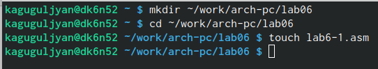{#fig:001 width=70%}

2. Введём в файл lab6-1.asm текст программы из листинга 6.1 (рис. @fig:002).

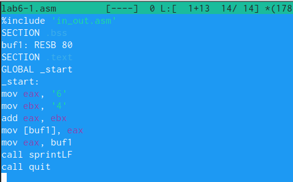{#fig:002 width=70%}

Создаём исполняемый файл и запускаем его (рис. @fig:003).

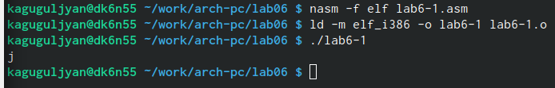{#fig:003 width=70%}

3. Исправим текст программы (Листинг 6.1) (рис. @fig:004).

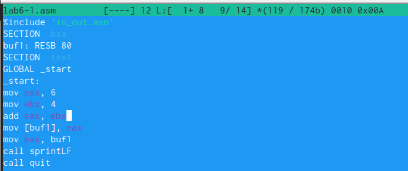{#fig:004 width=70%}

Создаём исполняемый файл и запустите его (рис. @fig:005).

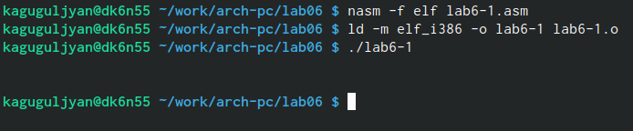{#fig:005 width=70%}

Отображается ли 10 при выводе на экран? Нет.

4. Создаём файл lab6-2.asm в каталоге ~/work/arch-pc/lab06 (рис. @fig:006).

{#fig:006 width=70%}

Введём в него текст программы из листинга 6.2 (рис. @fig:007).

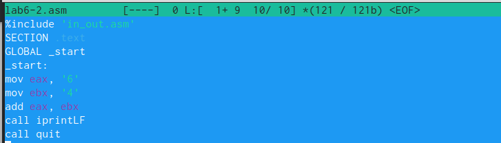{#fig:007 width=70%}

Создаём исполняемый файл и запускаем его (рис. @fig:008).

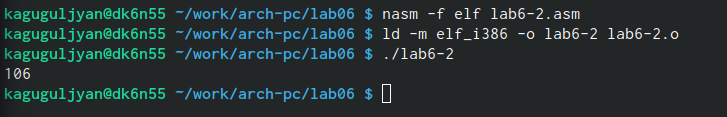{#fig:008 width=70%}

5. Аналогично предыдущему примеру изменим символы на числа (рис. @fig:009).

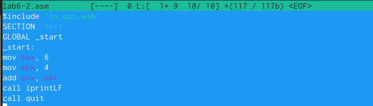{#fig:009 width=70%}

Создаём исполняемый файл и запускаем его (рис. @fig:010).

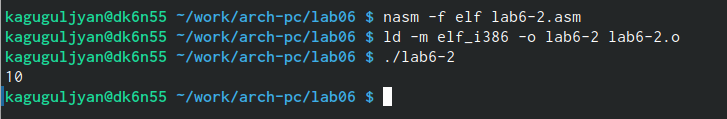{#fig:010 width=70%}

Какой результат будет получен при исполнении программы? 10.

Заменим функцию iprintLF на iprint. Создайте исполняемый файл и запустите его. iprintLF и iprint отличаются тем, что iprintLF оставляет пробел, а iprint нет (рис. @fig:011).

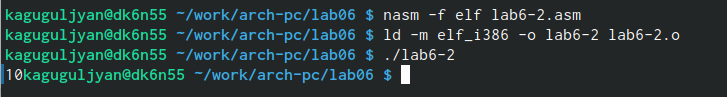{#fig:011 width=70%}

6. Создаём файл lab6-3.asm в каталоге ~/work/arch-pc/lab06 (рис. @fig:012).

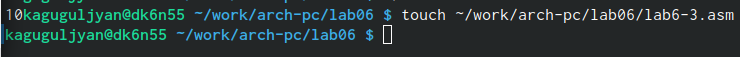{#fig:012 width=70%}

Внимательно изучим текст программы из листинга 6.3 и введём в lab6-3.asm (рис. @fig:013).

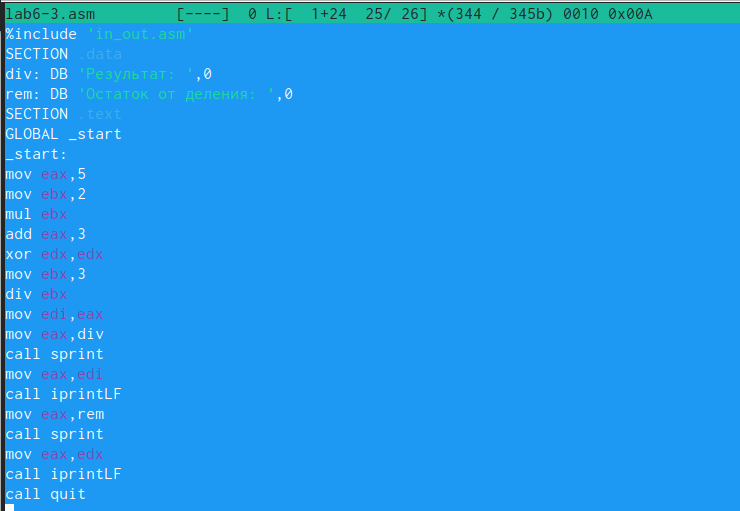{#fig:013 width=70%}

Создаём исполняемый файл и запускаем его (рис. @fig:014).

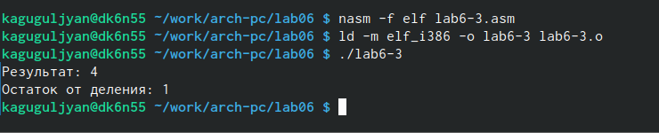{#fig:014 width=70%}

Изменим текст программы для вычисления выражения 𝑓(𝑥) = (4 ∗ 6 + 2)/5. Создаём
исполняемый файл и проверяем его работу (рис. @fig:015).

{#fig:015 width=70%}

7. Создаём файл variant.asm в каталоге ~/work/arch-pc/lab06: touch ~/work/arch-pc/lab06/variant.asm. Внимательно изучим текст программы из листинга 6.4 и введём в файл variant.asm (рис. @fig:016).

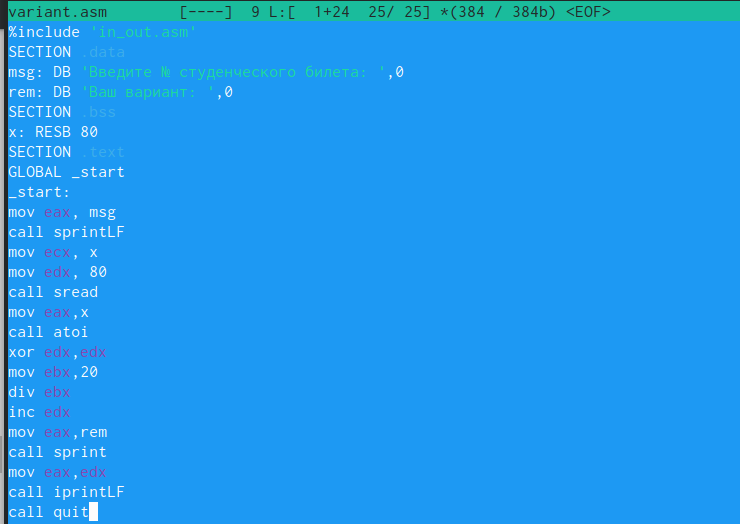{#fig:016 width=70%}

Создаём исполняемый файл и запускаем его (рис. @fig:017).

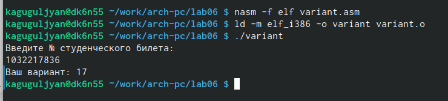{#fig:017 width=70%}

Вопросы:
 
1. xor edx,edx
mov ebx,20
div ebx
inc edx
mov eax,rem
call sprint
mov eax,edx
call iprintLF
call quit

2. Используются для чтения строки с клавиатуры и сохранения её в памяти.

3. Используется для вызова функции atoi, которая преобразует строку в целое число.

4. xor edx,edx
mov ebx,20
div ebx
inc edx

5. Результат деления записывается в регистр eax, а остаток от деления записывается в регистр edx.

6. Используется для увеличения значения в регистре edx на 1.

7. mov eax,rem
call sprint
mov eax,edx
call iprintLF
call quit

# Выводы

В ходе решения лабораторной работы я освоила арифметические инструкции языка ассамблера NASM.

# Список литературы{.unnumbered}

::: {#refs}
:::
