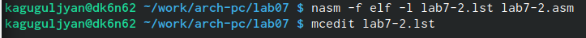

---
## Front matter
title: "Отчёт по лабораторной работе №7"
subtitle: "НПМбв-02-21"
author: "Гугульян Ксения Александровна"

## Generic otions
lang: ru-RU
toc-title: "Содержание"

## Bibliography
bibliography: bib/cite.bib
csl: pandoc/csl/gost-r-7-0-5-2008-numeric.csl

## Pdf output format
toc: true # Table of contents
toc-depth: 2
lof: true # List of figures
lot: true # List of tables
fontsize: 12pt
linestretch: 1.5
papersize: a4
documentclass: scrreprt
## I18n polyglossia
polyglossia-lang:
  name: russian
  options:
	- spelling=modern
	- babelshorthands=true
polyglossia-otherlangs:
  name: english
## I18n babel
babel-lang: russian
babel-otherlangs: english
## Fonts
mainfont: PT Serif
romanfont: PT Serif
sansfont: PT Sans
monofont: PT Mono
mainfontoptions: Ligatures=TeX
romanfontoptions: Ligatures=TeX
sansfontoptions: Ligatures=TeX,Scale=MatchLowercase
monofontoptions: Scale=MatchLowercase,Scale=0.9
## Biblatex
biblatex: true
biblio-style: "gost-numeric"
biblatexoptions:
  - parentracker=true
  - backend=biber
  - hyperref=auto
  - language=auto
  - autolang=other*
  - citestyle=gost-numeric
## Pandoc-crossref LaTeX customization
figureTitle: "Рис."
tableTitle: "Таблица"
listingTitle: "Листинг"
lofTitle: "Список иллюстраций"
lotTitle: "Список таблиц"
lolTitle: "Листинги"
## Misc options
indent: true
header-includes:
  - \usepackage{indentfirst}
  - \usepackage{float} # keep figures where there are in the text
  - \floatplacement{figure}{H} # keep figures where there are in the text
---

# Цель работы

Изучение команд условного и безусловного переходов. Приобретение навыков написания
программ с использованием переходов. Знакомство с назначением и структурой файла
листинга.

# Задание

1. Создайте каталог для программам лабораторной работы № 7, перейдите в него и создайте файл lab7-1.asm.

2. Введите в файл lab7-1.asm
текст программы из листинга 7.1. Создайте исполняемый файл и запустите его. Измените текст программы в соответствии с листингом 7.2.

3. Создайте файл lab7-2.asm в каталоге ~/work/arch-pc/lab07. Внимательно изучите текст
программы из листинга 7.3 и введите в lab7-2.asm. Создайте исполняемый файл и проверьте его работу для разных значений B.

4. Создайте файл листинга для программы из файла lab7-2.asm. Откройте файл листинга lab7-2.lst с помощью любого текстового редактора. Откройте файл с программой lab7-2.asm и в любой инструкции с двумя операндами удалить один операнд. Выполните трансляцию с получением файла листинга.

# Выполнение лабораторной работы

1. Создаём каталог для программам лабораторной работы № 7, перейдём в него и создайте файл lab7-1.asm (рис. @fig:001).

{#fig:001 width=70%}

2. Введём в файл lab7-1.asm
текст программы из листинга 7.1 (рис. @fig:002).

{#fig:002 width=70%}

Создаём исполняемый файл и запускаем его (рис. @fig:003).

{#fig:003 width=70%}

Изменим текст программы в соответствии с листингом 7.2 (рис. @fig:004).

{#fig:004 width=70%}

3. Создаём файл lab7-2.asm в каталоге ~/work/arch-pc/lab07. Внимательно изучаем текст
программы из листинга 7.3 и вводим в lab7-2.asm (рис. @fig:005).

{#fig:005 width=70%}

Создаём исполняемый файл и проверяем его работу для разных значений B (рис. @fig:006).

{#fig:006 width=70%}

4. Создаём файл листинга для программы из файла lab7-2.asm. Откроем файл листинга lab7-2.lst. Откройте файл с программой lab7-2.asm и в любой инструкции с двумя операндами
удалить один операнд. Выполните трансляцию с получением файла листинга (рис. @fig:007).

{#fig:007 width=70%} 

# Выводы

В ходе решения лабораторной работы я изучила команды условного и безусловного переходов. Приобрела навыки написания
программ с использованием переходов. Ознакомилась с назначением и структурой файла
листинга.

# Список литературы{.unnumbered}

::: {#refs}
:::
