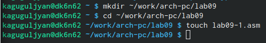
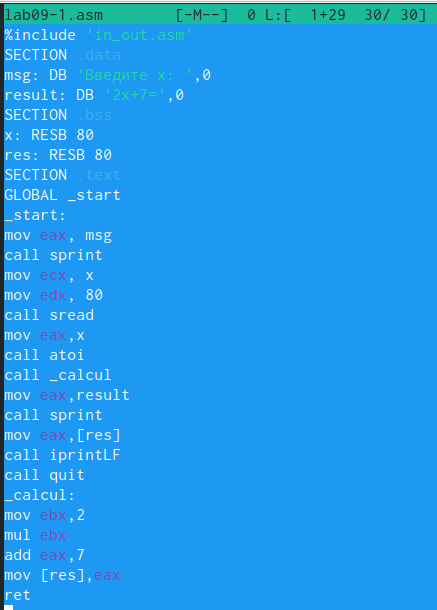
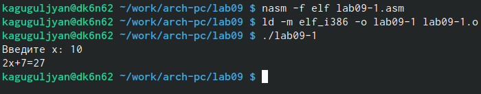
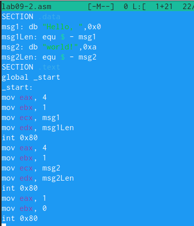
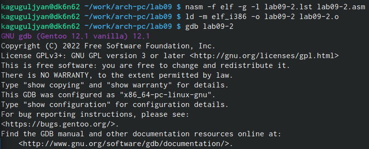
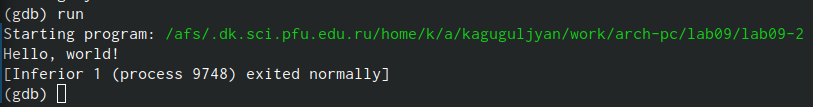
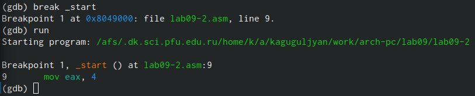
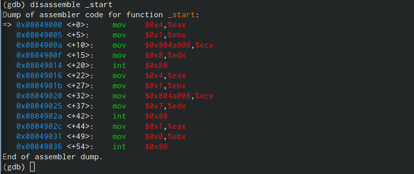
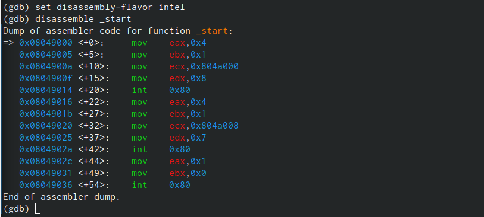

---
## Front matter
title: "Отчёт по лабораторной работе №9"
subtitle: "НПМбв-02-21"
author: "Гугульян Ксения Александровна"

## Generic otions
lang: ru-RU
toc-title: "Содержание"

## Bibliography
bibliography: bib/cite.bib
csl: pandoc/csl/gost-r-7-0-5-2008-numeric.csl

## Pdf output format
toc: true # Table of contents
toc-depth: 2
lof: true # List of figures
lot: true # List of tables
fontsize: 12pt
linestretch: 1.5
papersize: a4
documentclass: scrreprt
## I18n polyglossia
polyglossia-lang:
  name: russian
  options:
	- spelling=modern
	- babelshorthands=true
polyglossia-otherlangs:
  name: english
## I18n babel
babel-lang: russian
babel-otherlangs: english
## Fonts
mainfont: PT Serif
romanfont: PT Serif
sansfont: PT Sans
monofont: PT Mono
mainfontoptions: Ligatures=TeX
romanfontoptions: Ligatures=TeX
sansfontoptions: Ligatures=TeX,Scale=MatchLowercase
monofontoptions: Scale=MatchLowercase,Scale=0.9
## Biblatex
biblatex: true
biblio-style: "gost-numeric"
biblatexoptions:
  - parentracker=true
  - backend=biber
  - hyperref=auto
  - language=auto
  - autolang=other*
  - citestyle=gost-numeric
## Pandoc-crossref LaTeX customization
figureTitle: "Рис."
tableTitle: "Таблица"
listingTitle: "Листинг"
lofTitle: "Список иллюстраций"
lotTitle: "Список таблиц"
lolTitle: "Листинги"
## Misc options
indent: true
header-includes:
  - \usepackage{indentfirst}
  - \usepackage{float} # keep figures where there are in the text
  - \floatplacement{figure}{H} # keep figures where there are in the text
---

# Цель работы

Приобретение навыков написания программ с использованием подпрограмм. Знакомство
с методами отладки при помощи GDB и его основными возможностями.

# Задание

1. Создайте каталог для выполнения лабораторной работы № 9, перейдите в него и создайте файл lab09-1.asm. 

2. Введите в файл lab09-1.asm текст программы из листинга 9.1. Создайте исполняемый
файл и проверьте его работу. Измените текст программы, добавив подпрограмму _subcalcul в подпрограмму _calcul,
для вычисления выражения 𝑓(𝑔(𝑥)), где 𝑥 вводится с клавиатуры, 𝑓(𝑥) = 2𝑥 + 7, 𝑔(𝑥) = 3𝑥 − 1. 

3. Создайте файл lab09-2.asm с текстом программы из Листинга 9.2. Получите исполняемый файл. Загрузите исполняемый файл в отладчик gdb. Проверьте работу программы, запустив ее в оболочке GDB с помощью команды run.

# Выполнение лабораторной работы

1. Создаём каталог для выполнения лабораторной работы № 9, перейдём в него и создаём файл lab09-1.asm (рис. @fig:001).

{#fig:001 width=70%}

2. Введём в файл lab09-1.asm текст программы из листинга 9.1 (рис. @fig:002).

{#fig:002 width=70%}

Создаём исполняемый файл и проверяем его работу (рис. @fig:003).

{#fig:003 width=70%}

3. Создаём файл lab09-2.asm с текстом программы из Листинга 9.2 (рис. @fig:004).

{#fig:004 width=70%}

Получаем исполняемый файл и загружаем исполняемый файл в отладчик gdb (рис. @fig:005).

{#fig:005 width=70%}

Проверяем работу программы, запустив ее в оболочке GDB с помощью команды run (рис. @fig:006).

{#fig:006 width=70%}

Установим брейкпоинт на метку _start, с которой начинается выполнение любой ассемблерной программы, и запустим её (рис. @fig:007).

{#fig:007 width=70%}

Посмотрим дисассимилированный код программы с помощью команды disassemble
начиная с метки _start (рис. @fig:008).

{#fig:008 width=70%}

Переключимся на отображение команд с Intel’овским синтаксисом, введя команду set
disassembly-flavor intel (рис. @fig:009).

{#fig:009 width=70%}

Включаем режим псевдографики для более удобного анализа программы (рис. @fig:010).

{#fig:010 width=70%}

# Выводы

В ходе лабораторной работы я приобрела навыки написания программ с использованием подпрограмм. Ознакомилась с методами отладки при помощи GDB и его основными возможностями.

# Список литературы{.unnumbered}

::: {#refs}
:::
