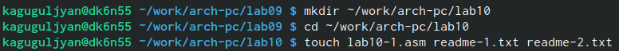
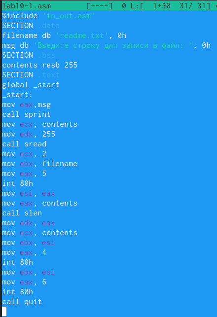
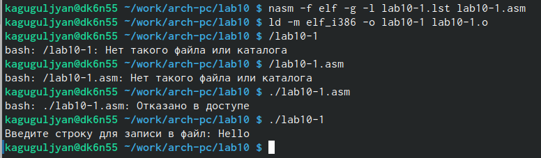
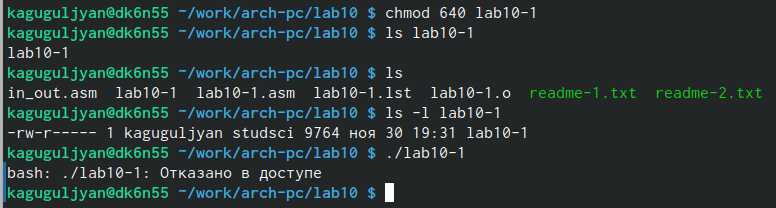
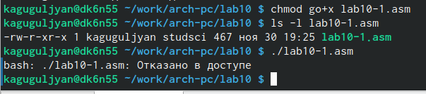
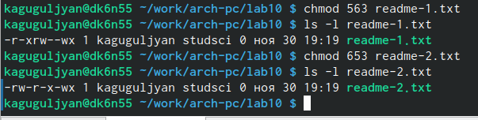

---
## Front matter
title: "Отчёт по лабораторной работе №10"
subtitle: "НПМбв-02-21"
author: "Гугульян Ксения Александровна"

## Generic otions
lang: ru-RU
toc-title: "Содержание"

## Bibliography
bibliography: bib/cite.bib
csl: pandoc/csl/gost-r-7-0-5-2008-numeric.csl

## Pdf output format
toc: true # Table of contents
toc-depth: 2
lof: true # List of figures
lot: true # List of tables
fontsize: 12pt
linestretch: 1.5
papersize: a4
documentclass: scrreprt
## I18n polyglossia
polyglossia-lang:
  name: russian
  options:
	- spelling=modern
	- babelshorthands=true
polyglossia-otherlangs:
  name: english
## I18n babel
babel-lang: russian
babel-otherlangs: english
## Fonts
mainfont: PT Serif
romanfont: PT Serif
sansfont: PT Sans
monofont: PT Mono
mainfontoptions: Ligatures=TeX
romanfontoptions: Ligatures=TeX
sansfontoptions: Ligatures=TeX,Scale=MatchLowercase
monofontoptions: Scale=MatchLowercase,Scale=0.9
## Biblatex
biblatex: true
biblio-style: "gost-numeric"
biblatexoptions:
  - parentracker=true
  - backend=biber
  - hyperref=auto
  - language=auto
  - autolang=other*
  - citestyle=gost-numeric
## Pandoc-crossref LaTeX customization
figureTitle: "Рис."
tableTitle: "Таблица"
listingTitle: "Листинг"
lofTitle: "Список иллюстраций"
lotTitle: "Список таблиц"
lolTitle: "Листинги"
## Misc options
indent: true
header-includes:
  - \usepackage{indentfirst}
  - \usepackage{float} # keep figures where there are in the text
  - \floatplacement{figure}{H} # keep figures where there are in the text
---

# Цель работы

Приобретение навыков написания программ для работы с файлами.

# Задание

1. Создайте каталог для программам лабораторной работы № 10, перейдите в него и
создайте файлы lab10-1.asm, readme-1.txt и readme-2.txt. 

2. Введите в файл lab10-1.asm текст программы из листинга 10.1 (Программа записи в
файл сообщения). Создайте исполняемый файл и проверьте его работу.

3. С помощью команды chmod измените права доступа к исполняемому файлу lab10-1,
запретив его выполнение. Попытайтесь выполнить файл. Объясните результат.

4. С помощью команды chmod измените права доступа к файлу lab10-1.asm с исходным
текстом программы, добавив права на исполнение. Попытайтесь выполнить его и
объясните результат.

5. В соответствии с вариантом в таблице 10.4 предоставить права доступа к файлу readme1.txt представленные в символьном виде, а для файла readme-2.txt – в двочном виде.
Проверить правильность выполнения с помощью команды ls -l.

# Выполнение лабораторной работы

1. Создаём каталог для программам лабораторной работы № 10, перейдём в него и
создаём файлы lab10-1.asm, readme-1.txt и readme-2.txt (рис. @fig:001).

{#fig:001 width=70%}

2. Введём в файл lab10-1.asm текст программы из листинга 10.1 (Программа записи в
файл сообщения) (рис. @fig:002).

{#fig:002 width=70%}

Создаём исполняемый файл и проверяем его работу (рис. @fig:003).

{#fig:003 width=70%}

3. С помощью команды chmod изменим права доступа к исполняемому файлу lab10-1,
запретив его выполнение (рис. @fig:004).

{#fig:004 width=70%}

4. С помощью команды chmod изменим права доступа к файлу lab10-1.asm с исходным
текстом программы, добавив права на исполнение. Попытаемся выполнить его (рис. @fig:005).

{#fig:005 width=70%}

5. В соответствии с вариантом в таблице 10.4 предоставим права доступа к файлу readme1.txt представленные в символьном виде, а для файла readme-2.txt – в двочном виде.
Проверим правильность выполнения с помощью команды ls -l (рис. @fig:006).

{#fig:006 width=70%}

# Выводы

В ходе решения лабораторной работы я приобрела навыки написания программ для работы с файлами.

# Список литературы{.unnumbered}

::: {#refs}
:::
